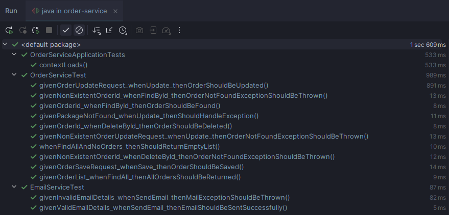
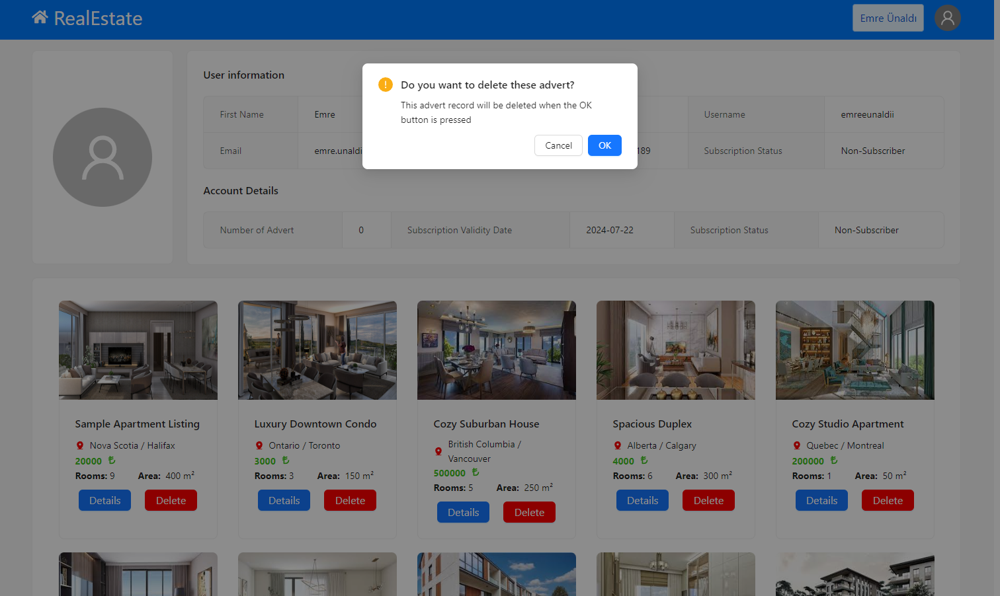

# `Real Estate Microservices | Real Estate Microservices App `

## `Backend Content`
- [Introduction](#backend-introduction)
- [Database Entity Relationships](#database-entity-relationships)
- [Backend Technology Stack](#backend-technology-stack)
- [Backend Build and Run Project](#backend-build-and-run-project)
- [Unit Test Results](#unit-test-results)

## `Frontend Content`
- [Introduction](#frontend-introduction)
- [Features](#features)
- [Frontend Technology Stack](#frontend-technology-stack)
- [Frontend Build and Run Project](#frontend-build-and-run-project)
- [Views](#views)

## `Backend Introduction`
# Real Estate Microservices

> This backend project is booted with [Java Spring Boot](https://spring.io)

> This backend project is designed and developed to stand up services that simulate the operations of the Property Management System and use them as a whole.

> This backend project was developed using microservice architecture, a distributed approach to building software systems. In microservice architecture, the application is divided into multiple loosely coupled services, each tasked with different functions. These services communicate with each other via HTTP requests and message queues.

> Caching mechanism with redis has been installed in this backend project. Global logging and file-based logging added with RabbitMQ. There was also Swagger integration

### Discovery Client Service
* The discovery server, implemented using Eureka, is responsible for service discovery and registration. 
It allows services to locate and communicate with each other without prior knowledge of network topology.
* This service can be accessed from port **[8761]**

### Auth Gateway Service
* This service, which can perform Authentication and Authorization operations with JWT tokne, also serves as a single entry point for customers to access various microservices through the API gateway implemented using Spring Cloud Gateway. It makes it easier to manage and secure the system's APIs by providing routing, filtering, and load balancing functions. 
* This service can be accessed on port **[8080]**

### User Service
* This service handles user transactions in the microservice application.
* This service can be accessed from port **[8081]**

### Photo Service
This microservice application allows uploading, saving and retrieving photos of advertisements as resources.
* This service can be accessed from port **[8082]**

### Advert Service
* This microservice application performs operations such as adding, deleting, listing, managing advertisement addresses.
* This service can be accessed from port **[8083]**

### Order Service
* This microservice application manages the asynchronous implementation of the subscription package model that works for the user to open an ad and purchase transactions.
* This service can be accessed from port **[8084]**

### Log Service
* This service handles log transactions in the microservice application.
* This service can be accessed from port **[8085]**

## `Database Entity Relationships`


## `Backend Technology Stack`
- **JDK 21**
- **Java 21**
- **Spring Boot**
- **Spring Core**
- **Spring Web**
- **Spring Data**
- **Spring Rest**
- **Spring Cloud (Eureka Server, Eureka Discovery Client, Gateway)**
- **Spring Security**
- **JWT**
- **PostgreSQL**
- **MongoDB**
- **Redis**
- **Docker**
- **Feign Client**
- **MapStruct**
- **Maven**
- **JUnit**
- **Mockito**
- **Lombok**

## `Backend Build and Run Project`
> Requires **JDK 21** to run the project, **Git** to pull from remote repository, and **Docker** to run docker-compose

Follow the steps to build and run the project:
- Clone the repository from Git
```bash
  git clone https://github.com/emre-unaldi/FMSS-Information-Technology-Fullstack-Web-Bootcamp-Final-Project.git real-estate 
```
- Open the project file
```shell
  cd real-estate
```
- Run the project with Docker
```shell
  docker-compose up -d && docker-compose down 
```
After all services are up and running with `Docker`:
- `PgAdmin4` interface can be accessed from port **5050**
- `Redis insight` interface can be accessed from port **5540**
- `RabbitMQ` interface can be accessed from port **15672**
- `Mongo Express` interface can be accessed from port **8088**
> All running services can access dependent graphic interfaces via the web without being dependent on the local environment.

## Unit Test Results
> User Service Tests  


> Photo Service Tests  


> Advert Service Tests  


> Order Service Tests  



---

## `Frontend Introduction`
# Real Estate Microservices Frontend

> This frontend project is booted with [Next.js](https://nextjs.org/)

> This frontend project is designed and developed to interact with the backend services that simulate the operations of the Property Management System.

> This frontend project allows users to manage their real estate advertisements and profile information. It is developed using modern frontend technologies and frameworks, ensuring a seamless and interactive user experience.

## `Features`
- **User Authentication**: Users can register and log in to the system.
- **Advertisement Management**: Users can view, create, manage, and delete their advertisements.
- **Profile Management**: Users have access to a basic profile page where they can view and update their information.
- **Responsive Design**: The application is designed to be responsive and user-friendly across various devices and screen sizes.

## `Frontend Technology Stack`
- **Next.js**: A React framework for production.
- **React**: A JavaScript library for building user interfaces.
- **TypeScript**: A typed superset of JavaScript that compiles to plain JavaScript.
- **Ant Design (antd)**: A design system for enterprise-level products.
- **Axios**: A promise-based HTTP client for the browser and Node.js.
- **jwt-decode**: A small browser library that helps decode JWTs.
- **react-icons**: Include popular icons in your React projects easily.
- **react-spinners**: A collection of loading spinners for React.
- **universal-cookie**: Universal cookies for React.

## `Frontend Build and Run Project`
> Requires **Node.js** and **npm** or **yarn** to run the project

Follow the steps to build and run the project:

- Clone the repository from Git
```bash
    git clone https://github.com/emre-unaldi/FMSS-Information-Technology-Fullstack-Web-Bootcamp-Final-Project.git real-estate-frontend
 ```

- Open the project file
```shell
  cd real-estate-frontend
```

- Install the dependencies
```bash
  npm install
  # or
  yarn install
```

Run the project in development mode

```bash
npm run dev
# or
yarn dev
```

Open [http://localhost:3000](http://localhost:3000) with your browser to see the result.

> To build the project for production, use npm run build or yarn build and then npm start or yarn start to start the server in production mode.

# Views


